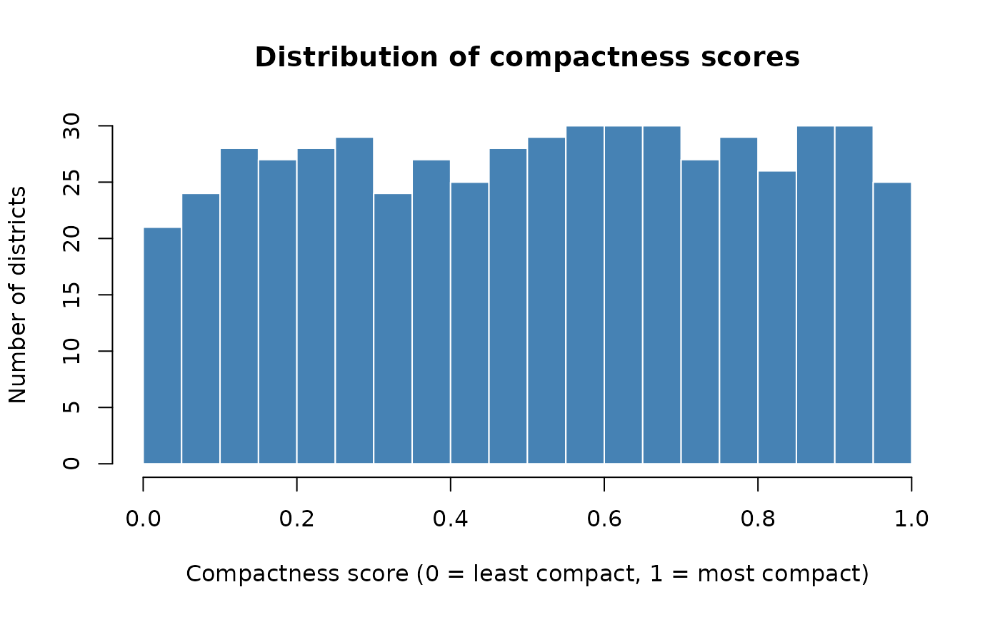
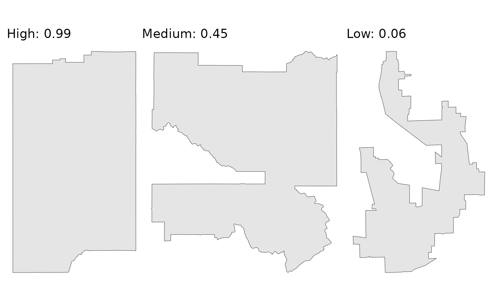
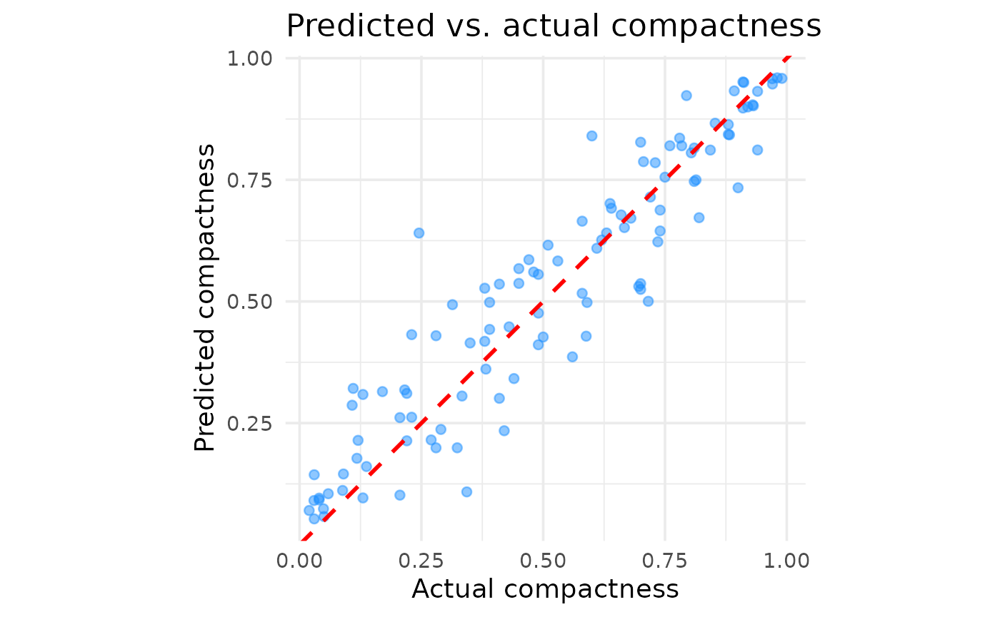
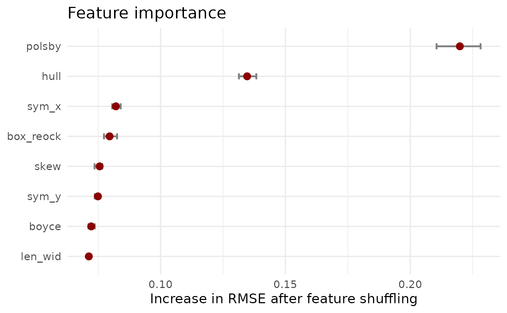
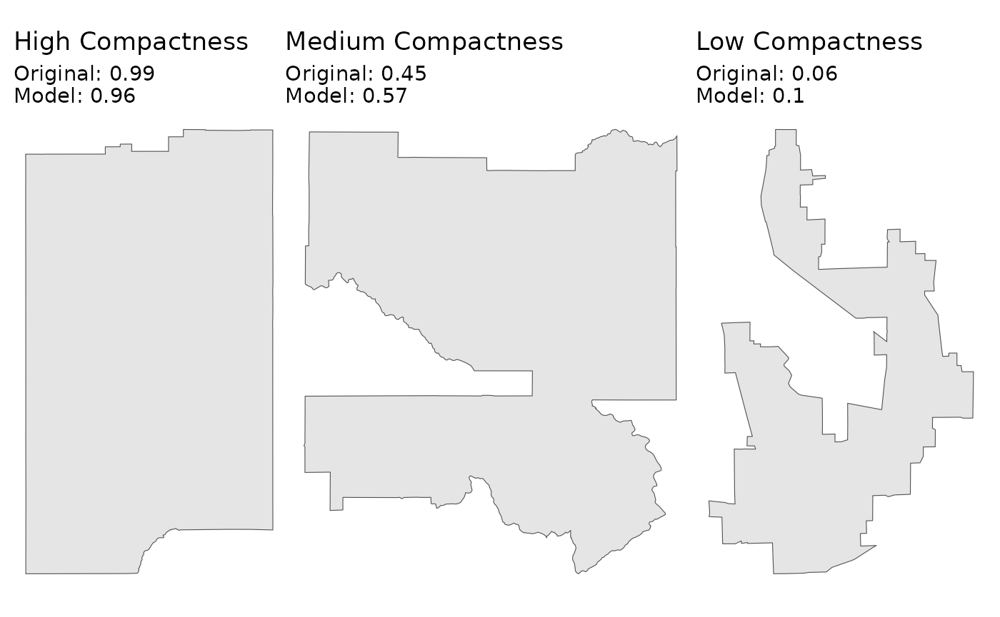

# The DESPLIM compactness score

The `desplim` package includes a compactness score that directly models
human intuition. Our approach is based on the work of [Kaufman et
al. (2021)](https://doi.org/10.1111/ajps.12603) who successfully trained
a model on human rankings of district shapes using common geometric
features.

Since the algorithm may need to calculate several thousand compactness
scores during complex split-merge problems, we built our own lightweight
and computationally efficient model using
[XGBoost](https://cran.r-project.org/web/packages/xgboost/index.html).

This vignette provides an overview of how the compactness score was
developed, using the original [replication
data](https://doi.org/10.7910/DVN/FA8FVF) and the
[tidymodels](https://www.tidymodels.org/) framework.

## 1. Data and Setup

A cleaned and pre-processed version of this dataset is included directly
in `desplim` as `compact_train`.

First, we load the required libraries.

``` r
library(desplim) # contains the cleaned training data
library(tidymodels) # core framework for modelling and pre-processing
library(xgboost) # model engine
library(DALEX) # model explainability
library(DALEXtra) # helper for DALEX
library(doFuture) # parallel processing
```

``` r
# Set up parallel processing
registerDoFuture()
n_cores <- max(1, parallel::detectCores(logical = FALSE) - 1)
plan(multisession, workers = n_cores)
```

The `compact_train` data contains a cleaned version of the
human-assigned compactness score (`compact`) obtained from the
[replication data](https://doi.org/10.7910/DVN/FA8FVF), ranging from 0
(least compact) to 1 (most compact), and 8 geometric features for 547
unique district shapes. The features were generated using the
[`redistmetrics`
package](https://alarm-redist.org/redistmetrics/index.html) — thanks to
the authors for the amazing work!

``` r
head(compact_train)
#>     compact     boyce box_reock      hull   len_wid    polsby      skew
#> 1 0.0300000 0.7649550 0.4896064 0.6262075 0.7534825 0.1145953 0.2822636
#> 2 0.2745098 0.7775373 0.4381054 0.6984327 0.8969073 0.2021440 0.4190817
#> 3 0.1300000 0.8304922 0.4871881 0.6415116 0.8888942 0.1258987 0.2738264
#> 4 0.1400000 0.8341214 0.4310280 0.6125937 0.6679481 0.1873192 0.3005736
#> 5 0.0100000 0.7016934 0.4300678 0.5800668 0.9635191 0.1019103 0.2754020
#> 6 0.1176471 0.8371308 0.3508467 0.5589451 0.3416772 0.1458956 0.1683645
#>       sym_x     sym_y
#> 1 0.6494468 0.5977191
#> 2 0.6090472 0.6896901
#> 3 0.5287228 0.5271888
#> 4 0.4305575 0.3530961
#> 5 0.4761292 0.4987708
#> 6 0.6358400 0.4629123
```

The 8 feature columns are standard geometric compactness metrics, all of
which can be computed directly from a district’s shape:

| Feature     | Description                                                                                                                     |
|-------------|---------------------------------------------------------------------------------------------------------------------------------|
| `polsby`    | Polsby-Popper — proportional to the ratio of district area to its perimeter squared (4πA/P²), scored 0–1 where 1 = most compact |
| `box_reock` | Bounding Box Reock — ratio of district area to the area of its minimum bounding rectangle, scored 0–1 where 1 = most compact    |
| `hull`      | Convex Hull — ratio of district area to the area of its convex hull, scored 0–1 where 1 = most compact                          |
| `boyce`     | Boyce-Clark — mean deviation of 16 evenly spaced radials from the interior centre, scored 0–∞ where **0 = most compact**        |
| `len_wid`   | Length-Width — ratio of district width to length via bounding box, scored 0–1 where 1 = equal dimensions (most compact)         |
| `sym_x`     | X-symmetry — area of the intersection of the district reflected over its X axis relative to total area, scored 0–1              |
| `sym_y`     | Y-symmetry — area of the intersection of the district reflected over its Y axis relative to total area, scored 0–1              |
| `skew`      | Skew — ratio of the maximum inscribed circle area to the minimum bounding circle area, scored 0–1 where 1 = most compact        |

``` r
hist(
  compact_train$compact,
  main = "Distribution of compactness scores",
  xlab = "Compactness score (0 = least compact, 1 = most compact)",
  ylab = "Number of districts",
  col = "steelblue",
  border = "white",
  breaks = 20
)
```



The histogram shows a relatively uniform distribution of compactness
scores, which is ideal for training a model that can recognise the full
spectrum of compactness scores.

The following plots show three sample districts from the dataset: one of
the least compact, one with a medium score, and one of the most compact.

``` r
library(ggplot2)
library(sf)
#> Linking to GEOS 3.12.1, GDAL 3.8.4, PROJ 9.4.0; sf_use_s2() is TRUE
library(dplyr)
library(patchwork)
ggplot2::theme_set(ggplot2::theme_minimal(base_size = 14))

# Find districts with high, medium, and low compactness
highly_compact <- kaufman_25 |>
  dplyr::slice_max(order_by = compact, n = 1)

moderately_compact <- kaufman_25 |>
  dplyr::filter(between(compact, 0.4, 0.6)) |>
  dplyr::slice(1)

non_compact <- kaufman_25 |>
  dplyr::slice_min(order_by = compact, n = 1)

# Create plots
p1 <- ggplot(highly_compact) +
  geom_sf() +
  ggtitle(paste("High:", round(highly_compact$compact, 2))) +
  theme_void()

p2 <- ggplot(moderately_compact) +
  geom_sf() +
  ggtitle(paste("Medium:", round(moderately_compact$compact, 2))) +
  theme_void()

p3 <- ggplot(non_compact) +
  geom_sf() +
  ggtitle(paste("Low:", round(non_compact$compact, 2))) +
  theme_void()

p1 + p2 + p3
```



As the plots demonstrate, the scores align well with our visual
intuition. The district with the low score is the most “irregular”,
while the district with the high score is much more “regular”.

We’ll split the data into a training set (80%) and a testing set (20%).
We stratify by the compact variable to ensure both sets have a similar
distribution of scores.

> **Note:** The chunks in sections 1–3 that include `eval = FALSE` are
> not executed during vignette build due to their long runtime. Their
> outputs (best parameters, test metrics, predictions, and feature
> importance) are loaded from pre-computed `.rda` files instead.

``` r
set.seed(123)
# Data split
data_split <- initial_split(compact_train, prop = 0.8, strata = compact)
train_data <- training(data_split)

# Recipe
model_recipe <- recipe(compact ~ ., data = train_data)
```

## 2. Model specification and tuning

With the data prepared, we can train a model to predict the compactness
score based on the 8 geometric features. We’ll use the well known
XGBoost algorithm for this task. The process involves three main steps:
building a workflow, tuning hyperparameters, and finalising the model.

### 2.1 Modelling workflow

First, we define our model specification using tidymodels. We mark
standard hyperparameters for tuning, which allows us to find the best
combination for our data. For more information, the documentation on the
[tune package](https://tune.tidymodels.org/index.html) comes in handy.
For the parameter specification, we apply the defaults provided by the
[dials package](https://dials.tidymodels.org/).

We then bundle our pre-processing recipe and the model specification
into a single workflow object. Finally, we create a 10-fold
cross-validation.

``` r
# XGBoost specification
xgb_spec <- boost_tree(
  trees = tune(),
  tree_depth = tune(),
  learn_rate = tune(),
  mtry = tune(),
  min_n = tune(),
  loss_reduction = tune(),
  sample_size = tune()
) |>
  set_engine(
    "xgboost",
    objective = "reg:squarederror",
    verbose = 0
  ) |>
  set_mode("regression")

# XGBoost parameter specification
xgb_params <- parameters(
  trees(),
  tree_depth(),
  learn_rate(),
  finalize(mtry(), train_data),
  min_n(),
  loss_reduction(),
  sample_prop()
)

# Workflow
xgb_workflow <- workflow() |>
  add_recipe(model_recipe) |>
  add_model(xgb_spec)

# Cross validation
set.seed(456)
cv_folds <- vfold_cv(train_data, v = 10)
```

### 2.2 Bayesian hyperparameter tuning

Instead of testing every possible combination of parameters (through
e.g. a grid search), we’ll use Bayesian optimisation. This is an
adaptive method that uses the results from past iterations to search for
the most promising future parameter combinations.

The baseline is 100 iterations, with early stopping after 20 rounds. The
Root Mean Squared Error (RMSE) is selected as the primary metric to
optimise.

``` r
set.seed(789)
tune_results <- tune_bayes(
  xgb_workflow,
  resamples = cv_folds,
  param_info = xgb_params,
  initial = 10,
  iter = 100,
  metrics = metric_set(rmse, mae),
  control = control_bayes(
    verbose_iter = TRUE,
    save_pred = FALSE,
    save_workflow = FALSE,
    no_improve = 20
  )
)
```

### 2.3 Finalising the model

Once the tuning process is complete, we select the parameters that
resulted in the lowest RMSE. We then use the `last_fit()` function,
which is a convenient helper that performs the final two steps:

- Fits the finalised workflow (with the best parameters) on the entire
  training set.

- Evaluates the performance of this final model on the held-out test
  set.

``` r
# Select the best parameters
best_params <- select_best(tune_results, metric = "rmse")
```

``` r
print(best_params)
#> # A tibble: 1 × 8
#>   trees tree_depth learn_rate  mtry min_n loss_reduction sample_size .config
#>   <int>      <int>      <dbl> <int> <int>          <dbl>       <dbl> <chr>  
#> 1   186          4     0.0281     6    20  0.00000000345       0.924 iter010
```

``` r
# Finalise the workflow
final_xgb_wf <- finalize_workflow(xgb_workflow, best_params)
final_fit <- last_fit(final_xgb_wf, data_split)
```

## 3. Model performance

Having a final, trained model, we need to evaluate its performance on
the held-out test data. This tells us how well the model is likely to
perform on new, unseen districts.

### 3.1 Overall performance metrics

First, we’ll examine the summary performance metrics. The
`collect_metrics()` function gives us the Root Mean Squared Error (RMSE)
and the R-squared from the test set.

``` r
# Compute test metrics
test_metrics <- collect_metrics(final_fit)
```

``` r
print(test_metrics)
#> # A tibble: 2 × 4
#>   .metric .estimator .estimate .config        
#>   <chr>   <chr>          <dbl> <chr>          
#> 1 rmse    standard       0.103 pre0_mod0_post0
#> 2 rsq     standard       0.877 pre0_mod0_post0
```

The low RMSE and high R-squared indicate that the model’s predictions
are, on average, very close to our target compactness scores.

### 3.2 Predicted versus actual scores

Metrics give us a high-level summary, but a plot of predicted versus
actual values helps us better understand the model predictions across
compactness scores.

``` r
# Collect the individual predictions on the test set
test_predictions <- collect_predictions(final_fit)
```

``` r
# Create the plot
predicted_vs_actual_plot <- ggplot(
  test_predictions,
  aes(x = compact, y = .pred)
) +
  geom_point(alpha = 0.5, color = "dodgerblue") +
  geom_abline(lty = 2, color = "red", linewidth = 1) +
  labs(
    title = "Predicted vs. actual compactness",
    x = "Actual compactness",
    y = "Predicted compactness"
  ) +
  coord_fixed()

print(predicted_vs_actual_plot)
```



The plot confirms the good performance. Aside from a few outliers, there
are no major areas where the model systematically over- or
under-predicts, suggesting it generalises well across the entire range
of compactness scores.

### 3.3 Feature importance

Finally, we want to understand what geometric features the model relies
on most to make its predictions. We can calculate feature importance by
measuring how much the model’s prediction error increases when a single
feature’s values are randomly shuffled.

``` r
# Extract the finalised and trained workflow
final_trained_workflow <- extract_workflow(final_fit)

# Create DALEX explainer and feature importance
explainer <- explain_tidymodels(
  final_trained_workflow,
  data  = train_data |> select(-compact),
  y     = train_data$compact,
  label = "XGBoost"
)
feature_importance <- model_parts(explainer)
```

``` r
# Create summary dataframe
importance_summary_df <- feature_importance |>
  as_tibble() |>
  dplyr::filter(variable != "_baseline_" & variable != "_full_model_") |>
  group_by(variable) |>
  summarise(
    mean_dropout = mean(dropout_loss),
    min_dropout = min(dropout_loss),
    max_dropout = max(dropout_loss),
    .groups = "drop"
  )

# Create plot
feature_importance_plot <- ggplot(
  importance_summary_df,
  aes(x = mean_dropout, y = reorder(variable, mean_dropout))
) +
  geom_errorbar(
    aes(xmin = min_dropout, xmax = max_dropout),
    width = 0.2,
    color = "gray50",
    linewidth = 0.9
  ) +
  geom_point(
    color = "darkred",
    size = 3
  ) +
  labs(
    title = "Feature importance",
    x = "Increase in RMSE after feature shuffling",
    y = NULL
  )

print(feature_importance_plot)
```



The results clearly show that Polsby-Popper and Convex Hull are the two
most influential features. This aligns with their common usage in
(re-)districting analysis and their relation to what is typically
perceived as compact. However, all features play a role in predicting
the compactness score, which justifies a more nuanced model setup.

## 4. Known limitations

The model performs well across the full range of compactness scores, but
a few limitations are worth keeping in mind:

- **Slow convergence at the extremes.** Because the training scores are
  human-assigned and rarely reach exactly 0 or 1, the model tends to
  under-predict near the high end and over-predict near the low end.
  Very compact or very non-compact districts will therefore receive
  scores that are somewhat pulled towards the centre.
- **Sensitivity to perimeter complexity.** Polsby-Popper — a
  perimeter-dependent measure — is the most influential feature.
  Districts with unusual perimeter characteristics (e.g., highly jagged
  boundaries) may receive predictions that diverge from human intuition,
  as illustrated in Section 5.2 below.
- **Training domain.** The model was trained on U.S. congressional and
  state legislative districts. Its behaviour on district shapes from
  very different political geographies is untested.

## 5. Usage

### 5.1 Basic usage

The model is available directly in the package through the
[`desplim_compactness()`](https://thesixmax.github.io/desplim/reference/desplim_compactness.md)
function. As a final validation, we check how its predictions compare to
the original human-assigned scores on the three example districts.

``` r
# Apply desplim_compactness to the original example districts
score_high <- desplim_compactness(highly_compact)$compactness
score_moderate <- desplim_compactness(moderately_compact)$compactness
score_low <- desplim_compactness(non_compact)$compactness

# Create comparison plots
p1_final <- ggplot(highly_compact) +
  geom_sf() +
  ggtitle(
    "High Compactness",
    subtitle = paste0(
      "Original: ",
      round(highly_compact$compact, 2),
      "\nModel: ",
      round(score_high, 2)
    )
  ) +
  theme_void()

p2_final <- ggplot(moderately_compact) +
  geom_sf() +
  ggtitle(
    "Medium Compactness",
    subtitle = paste0(
      "Original: ",
      round(moderately_compact$compact, 2),
      "\nModel: ",
      round(score_moderate, 2)
    )
  ) +
  theme_void()

p3_final <- ggplot(non_compact) +
  geom_sf() +
  ggtitle(
    "Low Compactness",
    subtitle = paste0(
      "Original: ",
      round(non_compact$compact, 2),
      "\nModel: ",
      round(score_low, 2)
    )
  ) +
  theme_void()

p1_final + p2_final + p3_final
```



As we can see, the scores from the
[`desplim_compactness()`](https://thesixmax.github.io/desplim/reference/desplim_compactness.md)
function are very close to the original compactness scores. However, it
should be noted that, due to the nature of the modelling approach, the
convergence towards 0 and 1 is slow, even for what appears to be highly
(non-)compact districts.

### 5.2 Diagnosing unexpected predictions

When a model prediction for a particular district seems unexpectedly
high or low,
[`desplim_compactness()`](https://thesixmax.github.io/desplim/reference/desplim_compactness.md)
provides a straightforward way to investigate. Setting
`keep_metrics = TRUE` returns not just the final score but also all 8
underlying geometric features. Inspecting these reveals which feature is
driving the unusual prediction.

To illustrate, we find the district in the example data with the largest
deviance between the model prediction and the human-assigned score.

``` r
# Calculate deviances
compare_scores <- desplim_compactness(kaufman_25, keep_metrics = TRUE) |>
  mutate(deviance = abs(compact - compactness))

# Find the district with the largest deviance
max_deviance <- compare_scores |>
  dplyr::slice_max(order_by = deviance, n = 1)

# Plot the result
ggplot(max_deviance) +
  geom_sf(fill = "firebrick", alpha = 0.7) +
  ggtitle(
    "Largest deviance in example data",
    subtitle = paste0(
      "Original score: ",
      round(max_deviance$compact, 2),
      "\nModel score: ",
      round(max_deviance$compactness, 2),
      "\nDeviance: ",
      round(max_deviance$deviance, 2)
    )
  ) +
  theme_void()
```


To understand the reason behind the high deviance we can investigate the
different geometrical features of the district:

``` r
print(max_deviance)
#> Simple feature collection with 1 feature and 11 fields
#> Geometry type: POLYGON
#> Dimension:     XY
#> Bounding box:  xmin: -88.02823 ymin: 42.12151 xmax: -87.88505 ymax: 42.36036
#> Geodetic CRS:  NAD83
#>     compact     boyce box_reock      hull   len_wid    polsby      skew
#> 1 0.4509804 0.7310901 0.3964636 0.5551677 0.4437754 0.1500558 0.2151164
#>       sym_x     sym_y compactness  deviance                       geometry
#> 1 0.4948946 0.4713435   0.1953411 0.2556393 POLYGON ((-88.02823 42.2698...
```

The shape has a very low Polsby-Popper score (indicating a highly
complex perimeter), while other features are not as low. Since we know
that the feature importance of Polsby-Popper is high, this disagreement
is somewhat expected. We do not consider this particular example to be
an indicator of poor model design, but rather highlights that the model
is sensitive to perimeter complexity.

## Session information

``` r
devtools::session_info(pkgs = c("attached"))
#> ─ Session info ───────────────────────────────────────────────────────────────
#>  setting  value
#>  version  R version 4.5.3 (2026-03-11)
#>  os       Ubuntu 24.04.4 LTS
#>  system   x86_64, linux-gnu
#>  ui       X11
#>  language en
#>  collate  C.UTF-8
#>  ctype    C.UTF-8
#>  tz       UTC
#>  date     2026-03-31
#>  pandoc   3.1.11 @ /opt/hostedtoolcache/pandoc/3.1.11/x64/ (via rmarkdown)
#>  quarto   NA
#> 
#> ─ Packages ───────────────────────────────────────────────────────────────────
#>  package       * version date (UTC) lib source
#>  broom         * 1.0.12  2026-01-27 [1] RSPM
#>  DALEX         * 2.5.3   2025-10-16 [1] RSPM
#>  DALEXtra      * 2.3.1   2026-01-14 [1] RSPM
#>  desplim       * 0.1.2   2026-03-31 [1] local
#>  devtools      * 2.5.0   2026-03-14 [1] RSPM
#>  dials         * 1.4.2   2025-09-04 [1] RSPM
#>  doFuture      * 1.2.1   2026-02-20 [1] RSPM
#>  dplyr         * 1.2.0   2026-02-03 [1] RSPM
#>  foreach       * 1.5.2   2022-02-02 [1] RSPM
#>  future        * 1.70.0  2026-03-14 [1] RSPM
#>  geos          * 0.2.5   2025-12-19 [1] RSPM
#>  ggplot2       * 4.0.2   2026-02-03 [1] RSPM
#>  infer         * 1.1.0   2025-12-18 [1] RSPM
#>  modeldata     * 1.5.1   2025-08-22 [1] RSPM
#>  parsnip       * 1.4.1   2026-01-11 [1] RSPM
#>  patchwork     * 1.3.2   2025-08-25 [1] RSPM
#>  purrr         * 1.2.1   2026-01-09 [1] RSPM
#>  recipes       * 1.3.1   2025-05-21 [1] RSPM
#>  redistmetrics * 1.0.11  2025-12-15 [1] RSPM
#>  rsample       * 1.3.2   2026-01-30 [1] RSPM
#>  scales        * 1.4.0   2025-04-24 [1] RSPM
#>  sf            * 1.1-0   2026-02-24 [1] RSPM
#>  tailor        * 0.1.0   2025-08-25 [1] RSPM
#>  tidymodels    * 1.4.1   2025-09-08 [1] RSPM
#>  tidyr         * 1.3.2   2025-12-19 [1] RSPM
#>  tune          * 2.0.1   2025-10-17 [1] RSPM
#>  usethis       * 3.2.1   2025-09-06 [1] RSPM
#>  workflows     * 1.3.0   2025-08-27 [1] RSPM
#>  workflowsets  * 1.1.1   2025-05-27 [1] RSPM
#>  xgboost       * 3.2.1.1 2026-03-18 [1] RSPM
#>  yardstick     * 1.3.2   2025-01-22 [1] RSPM
#> 
#>  [1] /home/runner/work/_temp/Library
#>  [2] /opt/R/4.5.3/lib/R/site-library
#>  [3] /opt/R/4.5.3/lib/R/library
#>  * ── Packages attached to the search path.
#> 
#> ──────────────────────────────────────────────────────────────────────────────
```
