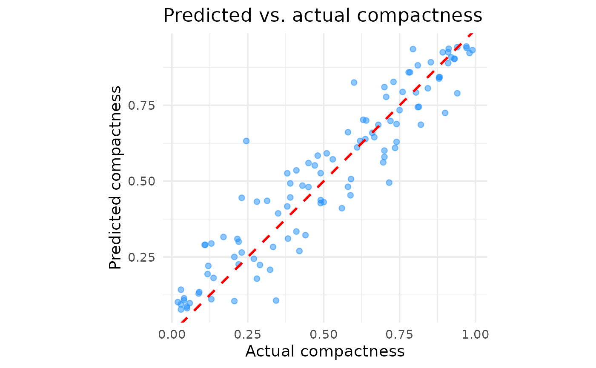
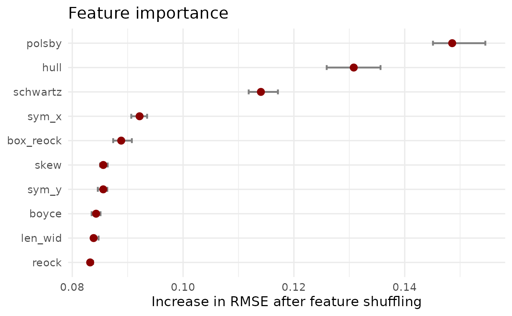
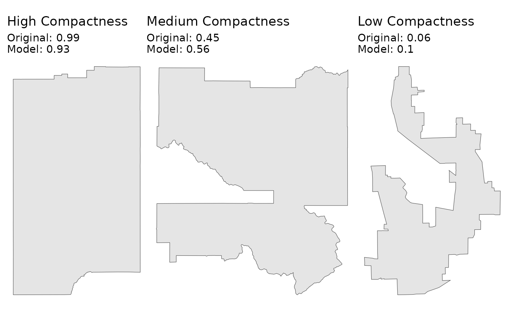

# The DESPLIM compactness score

When evaluating districts, “compactness” is an important feature. But
what makes a district compact? Often, it comes down to the human
intuition of “you know it when you see it”, which has historically been
hard to quantify.

To provide an alternative data-driven measure of compactness, the
`desplim` package includes a compactness score that directly models this
human intuition. Our approach is based on the work of [Kaufman et
al. (2021)](https://doi.org/10.1111/ajps.12603) who successfully trained
a model on human rankings of district shapes using common geometric
features.

The algorithm may need to calculate several thousands, if not millions,
of compactness scores during complex split-merge problems. For this
reason, we built our own lightweight and computationally efficient model
using
[XGBoost](https://cran.r-project.org/web/packages/xgboost/index.html).

This vignette provides an overview of how the metric was developed,
using the original [replication
data](https://doi.org/10.7910/DVN/FA8FVF) and the
[tidyverse](https://www.tidymodels.org/) framework.

## 1. Data and Setup

A cleaned and pre-processed version of this dataset is included directly
in `desplim` as `compact_train`.

First, let’s load the libraries required for modeling and diagnostics.

``` r
library(desplim) # contains the cleaned training data
library(tidymodels) # core framework for modelling and pre-processing
library(xgboost) # model engine
library(DALEX) # model explainability
library(DALEXtra) # helper for DALEX
library(doFuture) # parallel processing
```

``` r
# Set up parallel processing
registerDoFuture()
n_cores <- max(1, parallel::detectCores(logical = FALSE) - 1)
plan(multisession, workers = n_cores)
```

The `compact_train` data contains the human-assigned compactness score
(`compact`), ranging from 0 (least compact) to 1 (most compact) and 10
geometric features for 547 unique district shapes.

``` r
head(compact_train)
#>     compact     boyce box_reock      hull   len_wid    polsby     reock
#> 1 0.0300000 0.7649550 0.4896064 0.6262075 0.7534825 0.1145953 0.4057489
#> 2 0.2745098 0.7775373 0.4381054 0.6984327 0.8969073 0.2021440 0.3742773
#> 3 0.1300000 0.8304922 0.4871881 0.6415116 0.8888942 0.1258987 0.3280131
#> 4 0.1400000 0.8341214 0.4310280 0.6125937 0.6679481 0.1873192 0.3345650
#> 5 0.0100000 0.7016934 0.4300677 0.5800668 0.9635191 0.1019103 0.4143697
#> 6 0.1176471 0.8371308 0.3508467 0.5589451 0.3416772 0.1458956 0.1486579
#>    schwartz      skew     sym_x     sym_y
#> 1 0.3385193 0.2822636 0.6494468 0.5977191
#> 2 0.4496043 0.4190817 0.6090472 0.6896901
#> 3 0.3548220 0.2738264 0.5287228 0.5271888
#> 4 0.4328039 0.3005736 0.4305575 0.3530961
#> 5 0.3192339 0.2754020 0.4761292 0.4987708
#> 6 0.3819629 0.1683645 0.6358400 0.4629123
```

``` r
hist(compact_train$compact)
```


The histogram shows a relatively uniform distribution of compactness
scores, which is ideal for training a model that can recognise the full
spectrum from non-compact to highly compact shapes. As the output
suggests, no single geometric feature appears to be a perfect predictor
on its own.

The following plots show three sample districts from the dataset: one of
the least compact, one with a medium score, and one of the most compact.

``` r
library(ggplot2)
library(sf)
#> Linking to GEOS 3.12.1, GDAL 3.8.4, PROJ 9.4.0; sf_use_s2() is TRUE
library(dplyr)
library(patchwork)
ggplot2::theme_set(ggplot2::theme_minimal(base_size = 14))

# Find districts with high, medium, and low compactness
highly_compact <- kaufman_25 |>
  dplyr::slice_max(order_by = compact, n = 1)

moderately_compact <- kaufman_25 |>
  dplyr::filter(between(compact, 0.4, 0.6)) |>
  dplyr::slice(1)

non_compact <- kaufman_25 |>
  dplyr::slice_min(order_by = compact, n = 1)

# Create plots
p1 <- ggplot(highly_compact) +
  geom_sf() +
  ggtitle(paste("High:", round(highly_compact$compact, 2))) +
  theme_void()

p2 <- ggplot(moderately_compact) +
  geom_sf() +
  ggtitle(paste("Medium:", round(moderately_compact$compact, 2))) +
  theme_void()

p3 <- ggplot(non_compact) +
  geom_sf() +
  ggtitle(paste("Low:", round(non_compact$compact, 2))) +
  theme_void()

p1 + p2 + p3
```


As the plots demonstrate, the scores align well with our visual
intuition. The district with the low score is the most “irregular”,
while the district with the high score is much more “regular”.

We’ll split the data into a training set (80%) and a testing set (20%).
We stratify by the compact variable to ensure both sets have a similar
distribution of scores.

``` r
set.seed(123)
# Data split
data_split <- initial_split(compact_train, prop = 0.8, strata = compact)
train_data <- training(data_split)
test_data <- testing(data_split)

# Recipe
model_recipe <- recipe(compact ~ ., data = train_data)
```

## 2. Model specification and tuning

With the data prepared, we can train a model to predict the compactness
score based on the 10 geometric features. We’ll use the well known
XGBoost algorithm for this task. The process involves three main steps:
building a workflow, tuning hyperparameters, and finalising the model.

### 2.1 Modelling workflow

First, we define our model specification using tidymodels. We mark
standard hyperparameters for tuning, which allows us to find the best
combination for our data. For more information, the documentation on the
[tune package](https://tune.tidymodels.org/index.html) comes in handy.
For the parameter specification, we apply the defaults provided by the
[dials package](https://dials.tidymodels.org/).

We then bundle our (simple) pre-processing recipe and the model
specification into a single workflow object. Finally, we create a
10-fold cross-validation.

``` r
# XGBoost specification
xgb_spec <- boost_tree(
  trees = tune(),
  tree_depth = tune(),
  learn_rate = tune(),
  mtry = tune(),
  min_n = tune(),
  loss_reduction = tune(),
  sample_size = tune()
) |>
  set_engine(
    "xgboost",
    objective = "reg:squarederror",
    verbose = 0
  ) |>
  set_mode("regression")

# XGBoost parameter specification
xgb_params <- parameters(
  trees(),
  tree_depth(),
  learn_rate(),
  finalize(mtry(), train_data),
  min_n(),
  loss_reduction(),
  sample_prop()
)

# Workflow
xgb_workflow <- workflow() |>
  add_recipe(model_recipe) |>
  add_model(xgb_spec)

# Cross validation
set.seed(456)
cv_folds <- vfold_cv(train_data, v = 10)
```

### 2.2 Bayesian hyperparameter tuning

Instead of testing every possible combination of parameters (through a
grid search), we’ll use Bayesian optimisation. This is an adaptive
method that uses the results from past iterations to search for the most
promising future parameter combinations.

The baseline is 100 iterations, but it will stop early if it doesn’t
find a better model after 20 rounds. We’ll use Root Mean Squared Error
(RMSE) as the primary metric to optimise.

``` r
set.seed(789)
tune_results <- tune_bayes(
  xgb_workflow,
  resamples = cv_folds,
  param_info = xgb_params,
  initial = 10,
  iter = 100,
  metrics = metric_set(rmse, mae),
  control = control_bayes(
    verbose_iter = TRUE,
    save_pred = FALSE,
    save_workflow = FALSE,
    uncertain = 5,
    no_improve = 20
  )
)
```

### 2.3 Finalising the model

Once the tuning process is complete, we select the parameters that
resulted in the lowest RMSE. We then use the `last_fit()` function,
which is a convenient helper that performs the final two steps:

- Fits the finalised workflow (with the best parameters) on the entire
  training set.

- Evaluates the performance of this final model on the held-out test
  set.

``` r
# Select the best parameters
best_params <- select_best(tune_results, metric = "rmse")
```

``` r
print(best_params)
#> # A tibble: 1 × 8
#>   trees tree_depth learn_rate  mtry min_n loss_reduction sample_size .config
#>   <int>      <int>      <dbl> <int> <int>          <dbl>       <dbl> <chr>  
#> 1   811         14    0.00734     9    31       1.67e-10       0.646 iter008
```

``` r
# Finalise the workflow
final_xgb_wf <- finalize_workflow(xgb_workflow, best_params)
final_fit <- last_fit(final_xgb_wf, data_split)
```

## 3. Model performance

Having a final, trained model, we need to evaluate its performance on
the held-out test data. This tells us how well the model is likely to
perform on new, unseen districts.

### 3.1 Overall performance metrics

First, we’ll examine the summary performance metrics. The
`collect_metrics()` function gives us the Root Mean Squared Error (RMSE)
and the R-squared from the test set.

``` r
# Compute test metrics
test_metrics <- collect_metrics(final_fit)
```

``` r
print(test_metrics)
#> # A tibble: 2 × 4
#>   .metric .estimator .estimate .config        
#>   <chr>   <chr>          <dbl> <chr>          
#> 1 rmse    standard       0.101 pre0_mod0_post0
#> 2 rsq     standard       0.881 pre0_mod0_post0
```

The low RMSE and high R-squared indicate that the model’s predictions
are, on average, very close to our target compactness scores.

### 3.2 Predicted versus actual scores

Metrics give us a high-level summary, but a plot of predicted versus
actual values helps us better understand the model predictions across
compactness scores.

``` r
# Collect the individual predictions on the test set
test_predictions <- collect_predictions(final_fit)
```

``` r
# Create the plot
predicted_vs_actual_plot <- ggplot(
  test_predictions,
  aes(x = compact, y = .pred)
) +
  geom_point(alpha = 0.5, color = "dodgerblue") +
  geom_abline(lty = 2, color = "red", linewidth = 1) +
  labs(
    title = "Predicted vs. actual compactness",
    x = "Actual compactness",
    y = "Predicted compactness"
  ) +
  coord_fixed()

print(predicted_vs_actual_plot)
```



The plot confirms the presumed good performance. Aside from a few
outliers, there are no major areas where the model systematically over-
or under-predicts, suggesting it generalises well across the entire
range of compactness scores.

### 3.3 Feature importance

Finally, we want to understand what geometric features the model relies
on most to make its predictions. We can calculate feature importance by
measuring how much the model’s prediction error increases when a single
feature’s values are randomly shuffled.

``` r
# Extract the finalised and trained workflow
final_trained_workflow <- extract_workflow(final_fit)

# Create DALEX explainer and feature importance
train_predictors <- train_data |> select(-compact)
train_outcome <- train_data$compact
explainer <- explain_tidymodels(
  final_trained_workflow,
  data = train_predictors,
  y = train_outcome,
  label = "XGBoost"
)
feature_importance <- model_parts(explainer)
```

``` r
# Create summary dataframe
importance_summary_df <- feature_importance %>%
  as_tibble() %>%
  dplyr::filter(variable != "_baseline_" & variable != "_full_model_") %>%
  group_by(variable) %>%
  summarise(
    mean_dropout = mean(dropout_loss),
    min_dropout = min(dropout_loss),
    max_dropout = max(dropout_loss),
    .groups = "drop"
  )

# Create plot
feature_importance_plot <- ggplot(
  importance_summary_df,
  aes(x = mean_dropout, y = reorder(variable, mean_dropout))
) +
  geom_errorbarh(
    aes(xmin = min_dropout, xmax = max_dropout),
    height = 0.2,
    color = "gray50",
    linewidth = 0.9
  ) +
  geom_point(
    color = "darkred",
    size = 3
  ) +
  labs(
    title = "Feature importance",
    x = "Increase in RMSE after feature shuffling",
    y = NULL
  )
#> Warning: `geom_errorbarh()` was deprecated in ggplot2 4.0.0.
#> ℹ Please use the `orientation` argument of `geom_errorbar()` instead.
#> This warning is displayed once every 8 hours.
#> Call `lifecycle::last_lifecycle_warnings()` to see where this warning was
#> generated.

print(feature_importance_plot)
#> `height` was translated to `width`.
```



The results clearly show that Polsby-Popper and Convex Hull are the two
most influential features. This aligns with their common usage in
(re-)districting analysis and their relation to what is typically
perceived as compact. However, all features play a role in predicting
the compactness score, justifying a more nuanced model setup.

## 4. Usage

This model is now available in the package through the
[`desplim_compactness()`](https://thesixmax.github.io/desplim/reference/desplim_compactness.md)
function.

The final test is to see how the model’s predictions compare to the
original compactness scores on the example districts.

``` r
# Apply desplim_compactness to the original example districts
score_high <- desplim_compactness(highly_compact)$compactness
score_moderate <- desplim_compactness(moderately_compact)$compactness
score_low <- desplim_compactness(non_compact)$compactness

# Create comparison plots
p1_final <- ggplot(highly_compact) +
  geom_sf() +
  ggtitle(
    "High Compactness",
    subtitle = paste0(
      "Original: ",
      round(highly_compact$compact, 2),
      "\nModel: ",
      round(score_high, 2)
    )
  ) +
  theme_void()

p2_final <- ggplot(moderately_compact) +
  geom_sf() +
  ggtitle(
    "Medium Compactness",
    subtitle = paste0(
      "Original: ",
      round(moderately_compact$compact, 2),
      "\nModel: ",
      round(score_moderate, 2)
    )
  ) +
  theme_void()

p3_final <- ggplot(non_compact) +
  geom_sf() +
  ggtitle(
    "Low Compactness",
    subtitle = paste0(
      "Original: ",
      round(non_compact$compact, 2),
      "\nModel: ",
      round(score_low, 2)
    )
  ) +
  theme_void()

p1_final + p2_final + p3_final
```



As we can see, the scores from the
[`desplim_compactness()`](https://thesixmax.github.io/desplim/reference/desplim_compactness.md)
function are very close to the original compactness scores.

Finally, we can investigate the example district with the largest
deviance between the model prediction and actual compactness score. We
set `keep_metrics = TRUE` in the
[`desplim_compactness()`](https://thesixmax.github.io/desplim/reference/desplim_compactness.md)
function. This returns not just the final score, but also the 10
underlying geometric features, which is useful for diagnosing specific
cases.

``` r
# Calculate deviances
compare_scores <- desplim_compactness(kaufman_25, keep_metrics = TRUE) |>
  mutate(deviance = abs(compact - compactness))

# Find the district with the largest deviance
max_deviance <- compare_scores %>%
  dplyr::slice_max(order_by = deviance, n = 1)

# Plot the result
ggplot(max_deviance) +
  geom_sf(fill = "firebrick", alpha = 0.7) +
  ggtitle(
    "Largest deviance in example data",
    subtitle = paste0(
      "Original score: ",
      round(max_deviance$compact, 2),
      "\nModel score: ",
      round(max_deviance$compactness, 2),
      "\nDeviance: ",
      round(max_deviance$deviance, 2)
    )
  ) +
  theme_void()
```


The main reason for the high deviance is the disagreement between the
different geometrical feaures of the district:

``` r
print(max_deviance)
#> Simple feature collection with 1 feature and 13 fields
#> Geometry type: POLYGON
#> Dimension:     XY
#> Bounding box:  xmin: -88.02823 ymin: 42.12151 xmax: -87.88505 ymax: 42.36036
#> Geodetic CRS:  NAD83
#>     compact     boyce box_reock      hull   len_wid    polsby     reock
#> 1 0.4509804 0.7310901 0.3964636 0.5551677 0.4437754 0.1500558 0.2241015
#>    schwartz      skew     sym_x     sym_y compactness  deviance
#> 1 0.3873703 0.2151164 0.4948946 0.4713435   0.1375506 0.3134298
#>                         geometry
#> 1 POLYGON ((-88.02823 42.2698...
```

The shape has a very low polsby score (indicating a highly complex
perimeter), while other features are not as low. This example doesn’t
indicate model failure. It rather highlights that the model is sensitive
to perimeter complexity.

``` r
devtools::session_info(pkgs = c("attached"))
#> ─ Session info ───────────────────────────────────────────────────────────────
#>  setting  value
#>  version  R version 4.5.2 (2025-10-31)
#>  os       Ubuntu 24.04.3 LTS
#>  system   x86_64, linux-gnu
#>  ui       X11
#>  language en
#>  collate  C.UTF-8
#>  ctype    C.UTF-8
#>  tz       UTC
#>  date     2025-12-26
#>  pandoc   3.1.11 @ /opt/hostedtoolcache/pandoc/3.1.11/x64/ (via rmarkdown)
#>  quarto   NA
#> 
#> ─ Packages ───────────────────────────────────────────────────────────────────
#>  package       * version date (UTC) lib source
#>  broom         * 1.0.11  2025-12-04 [1] RSPM
#>  DALEX         * 2.5.3   2025-10-16 [1] RSPM
#>  DALEXtra      * 2.3.0   2023-05-26 [1] RSPM
#>  desplim       * 0.1.1   2025-12-26 [1] local
#>  devtools      * 2.4.6   2025-10-03 [1] RSPM
#>  dials         * 1.4.2   2025-09-04 [1] RSPM
#>  doFuture      * 1.1.3   2025-12-09 [1] RSPM
#>  dplyr         * 1.1.4   2023-11-17 [1] RSPM
#>  foreach       * 1.5.2   2022-02-02 [1] RSPM
#>  future        * 1.68.0  2025-11-17 [1] RSPM
#>  geos          * 0.2.5   2025-12-19 [1] RSPM
#>  ggplot2       * 4.0.1   2025-11-14 [1] RSPM
#>  infer         * 1.1.0   2025-12-18 [1] RSPM
#>  modeldata     * 1.5.1   2025-08-22 [1] RSPM
#>  parsnip       * 1.4.0   2025-12-01 [1] RSPM
#>  patchwork     * 1.3.2   2025-08-25 [1] RSPM
#>  purrr         * 1.2.0   2025-11-04 [1] RSPM
#>  recipes       * 1.3.1   2025-05-21 [1] RSPM
#>  redistmetrics * 1.0.11  2025-12-15 [1] RSPM
#>  rsample       * 1.3.1   2025-07-29 [1] RSPM
#>  scales        * 1.4.0   2025-04-24 [1] RSPM
#>  sf            * 1.0-23  2025-11-28 [1] RSPM
#>  tailor        * 0.1.0   2025-08-25 [1] RSPM
#>  tidymodels    * 1.4.1   2025-09-08 [1] RSPM
#>  tidyr         * 1.3.2   2025-12-19 [1] RSPM
#>  tune          * 2.0.1   2025-10-17 [1] RSPM
#>  usethis       * 3.2.1   2025-09-06 [1] RSPM
#>  workflows     * 1.3.0   2025-08-27 [1] RSPM
#>  workflowsets  * 1.1.1   2025-05-27 [1] RSPM
#>  xgboost       * 3.1.2.1 2025-12-03 [1] RSPM
#>  yardstick     * 1.3.2   2025-01-22 [1] RSPM
#> 
#>  [1] /home/runner/work/_temp/Library
#>  [2] /opt/R/4.5.2/lib/R/site-library
#>  [3] /opt/R/4.5.2/lib/R/library
#>  * ── Packages attached to the search path.
#> 
#> ──────────────────────────────────────────────────────────────────────────────
```
